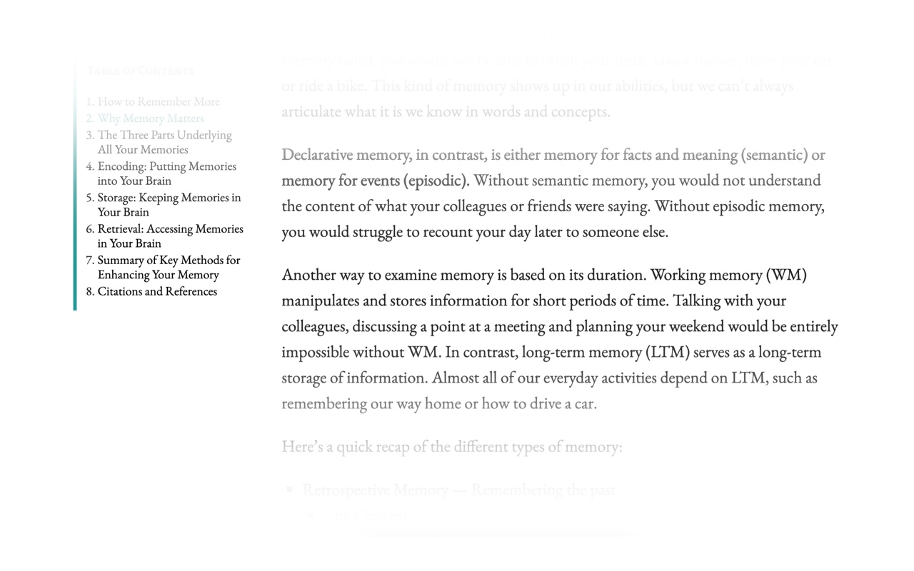

# Focused Reader Extension

## Introduction

This project aims to provide an easy way to remove distractions and information overloading when reading online content. Great for focusing solely on what you're reading.

## Usage

Press the Red Button to activate. A white glow should appear on the top and bottom, covering any text.

Press the Green Button to deactivate. The page should return to normal.
